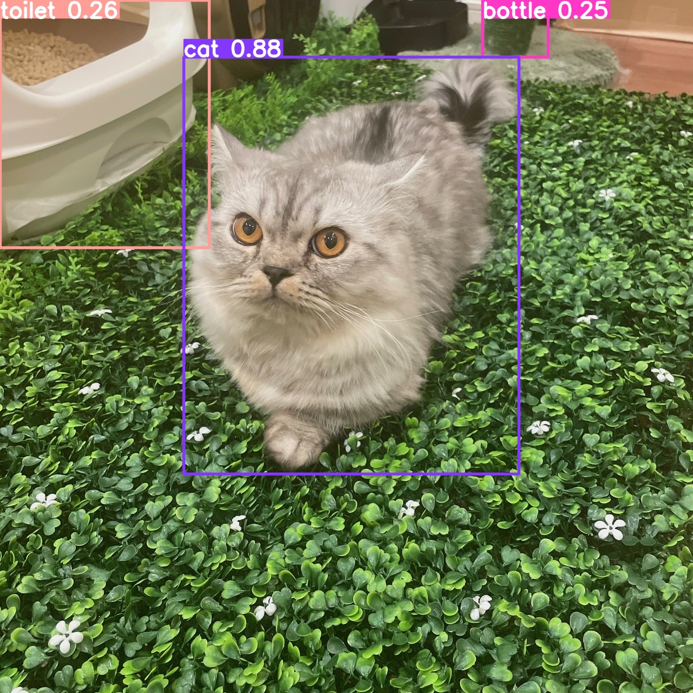

# yolo v8

[CODE SANDBOX] yolo v8 試す

https://docs.ultralytics.com/ja/models/yolov8/#supported-tasks-and-modes

# How to Run

1. setup https://www.anaconda.com/download
2. `conda create -n yolo-v8 python`
3. `conda activate yolo-v8`
4. `pip install -r requirements.txt`
5. `python test.py`
